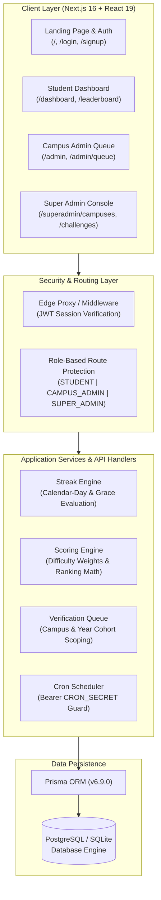
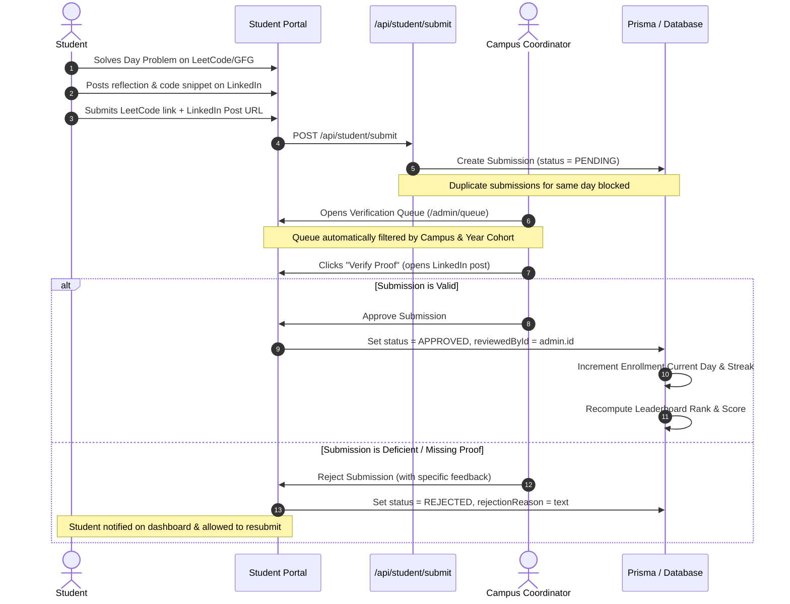
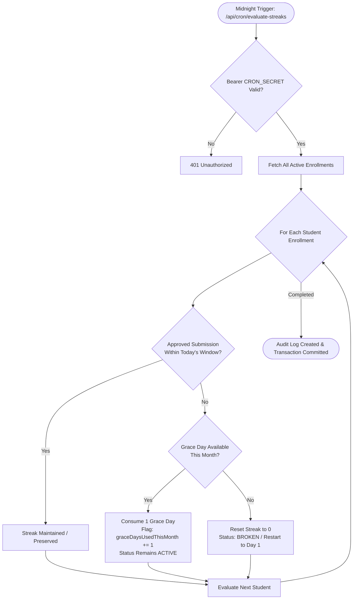

# 🚀 ALTA Track — DSA Challenge & Consistency Platform

<div align="center">


<p align="center">
  <b>An AI-first, multi-tenant Data Structures & Algorithms verification, streak engine, and proof-of-work platform engineered for university computer science cohorts.</b>
</p>

<p align="center">
  <i>Proudly designed and developed by students of <b>ALTA Tech Club Indore</b> for ALTA students across partner campuses.</i>
</p>

[Key Features](#-key-features) •
[System Architecture](#-system-architecture) •
[Workflows](#-core-workflows) •
[Tech Stack](#-technology-stack) •
[Getting Started](#-getting-started) •
[Database & Seeding](#-database--seeding) •
[The Team](#-the-team--visionaries)

</div>

---

## 📖 Executive Summary

**ALTA Track** replaces fragmented spreadsheets and unverified coding groups with an automated, tamper-proof learning ecosystem. Built for multi-campus university training programs, it manages multi-month coding tracks:

- **BASE 111**: 111-day foundational DSA challenge for 1st-year undergraduates.
- **APEX 151**: 151-day advanced algorithmic challenge spanning Trees, Dynamic Programming, Graphs, and Segment Trees.

Students solve daily algorithmic problems, submit verified proof of work (LeetCode/GFG solution + public LinkedIn reflection), and build streaks. Submissions are verified by faculty coordinators and campus admins. Reaching challenge milestones unlocks exclusive rewards and 1-on-1 mock technical interview preparation.

---

## ✨ Key Features

### 1. 🛡️ Zero-Storage Proof-of-Work Architecture
- **$0 Cloud Operating Cost**: Avoids high-cost object storage pipelines (S3, Cloudinary).
- The public LinkedIn post serves as permanent, externally-hosted proof of work.
- Campus admins review submissions with one-click direct links.

### 2. ⚡ Strict Calendar-Day Streak Engine
- **Anti-Cheat Logic**: A student's streak increases at most **once per calendar day**. Solving multiple problems in a single day counts towards solved questions and weighted points, but prevents artificial streak inflation.
- **Configurable Grace Policy**: Automated monthly grace days (e.g. 1 grace day per calendar month).
- **Automated Nightly Cron**: Evaluates non-submissions; applies grace periods or triggers automatic reset to Day 1.

### 3. 🎯 Dynamic Difficulty Scoring & Fair Rankings
- Weighted problem scoring:
  - **Easy**: `10 pts`
  - **Medium**: `25 pts`
  - **Hard**: `50 pts`
- Consistency multipliers reward continuous streaks over sporadic bursts.
- Deterministic tie-breaking: `Total Score (desc) → Streak Count (desc) → Current Day (desc) → Registration Date (asc)`.

### 4. 🏢 Multi-Campus & Academic Year Scoping (RBAC)
- **Role Hierarchy**: `SUPER_ADMIN`, `CAMPUS_ADMIN`, and `STUDENT`.
- **Cohort-Wise Delegation**: Super Admins can assign Campus Admins to specific academic years (`Year 1`, `Year 2`, `Year 3`, `Year 4`, or `All Years`).
- Coordinators can only inspect, review, and evaluate students within their assigned campus and cohort.

### 5. 🔒 High-Bar Security & Data Privacy
- **Zero Public Email Exposure**: Public leaderboards completely strip student email addresses to eliminate harvesting risks.
- **Protected Cron Handlers**: Streak evaluation routes require strict timing-safe Bearer authentication (`CRON_SECRET`).
- **Cascade-Safe Administrative Transactions**: Deleting or reassigning campus coordinators automatically preserves student submission approvals and historical logs without foreign-key corruption.

---

## 🏗 System Architecture



---

## 🔄 Core Workflows

### 1. Student Submission & Review Lifecycle



### 2. Nightly Streak & Grace Period Engine



---

## 🛠 Technology Stack

| Layer | Technology | Description |
| :--- | :--- | :--- |
| **Framework** | **Next.js 16.3.4 (App Router)** | Hybrid static & server-side rendering with Turbopack compilation |
| **Language** | **TypeScript 5.0+** | Strict end-to-end type safety across schemas, API routes, and components |
| **Styling** | **TailwindCSS v4 & Vanilla CSS** | Bespoke glassmorphism design system, dark mode palette, and micro-interactions |
| **Database & ORM** | **Prisma ORM (v6.9.0)** | Schema modeling, relational queries, migrations, and transactions |
| **Database Engines** | **PostgreSQL & SQLite** | PostgreSQL for live production (Supabase/Neon); SQLite for zero-config local dev |
| **Authentication** | **Stateless JWT (`jose` + `bcryptjs`)** | HttpOnly cookie-based session tokens with 12-round bcrypt password hashing |
| **Data Visualization** | **Recharts** | Real-time performance breakdown, difficulty split, and streak trends |
| **Icons & UI** | **Lucide React & Radix UI** | Accessible primitives and consistent icon system |
| **Validation** | **Zod** | Runtime schema parsing and input sanitization |

---

## 📂 Project Structure

```text
ALTA-Track/
├── prisma/
│   ├── schema.prisma              # Relational schema (Campuses, Users, Challenges, Submissions)
│   ├── seed-data.json             # Official curriculum (111 BASE & 151 APEX problems)
│   ├── seed-production.ts         # Production seed script (0 mock users, official curriculum)
│   ├── clean-data.ts              # Purge script for resetting mock/test datasets
│   └── seed-200-students.ts       # High-volume stress testing generator
├── src/
│   ├── app/
│   │   ├── page.tsx               # Landing page with ALTA Tech Club showcase & modal
│   │   ├── dashboard/             # Student tracking portal & submission flow
│   │   ├── leaderboard/           # Global & campus-filtered leaderboards
│   │   ├── admin/                 # Campus Coordinator portal & verification queue
│   │   ├── superadmin/            # Super Admin console (Campuses, Challenges, Metrics)
│   │   └── api/                   # 29 REST endpoints (Auth, Students, Admins, Superadmin, Cron)
│   ├── components/                # Reusable UI components, modals, and charts
│   ├── lib/
│   │   ├── prisma.ts              # Global Prisma client singleton
│   │   ├── auth.ts                # Password hashing, JWT signing, and RBAC guards
│   │   ├── scoring.ts             # Difficulty weighting and ranking math
│   │   ├── streaks.ts             # Calendar-day streak evaluation logic
│   │   └── __tests__/             # Automated integration & unit test suites
│   └── middleware.ts              # Edge role authorization proxy
└── public/                        # Static assets, branding, and icons
```

---

## 🚦 Getting Started

### Prerequisites
- **Node.js**: v18.18.0 or higher
- **Package Manager**: `npm`, `pnpm`, or `bun`

### 1. Clone & Install
```bash
git clone https://github.com/rishabhvyas17/ALTA-Track.git
cd ALTA-Track
npm install
```

### 2. Environment Configuration
Create a `.env` file in the root directory:

```env
# Database Connection (PostgreSQL for production, SQLite for local dev)
DATABASE_URL="file:./dev.db"

# Authentication Secret (Use a strong random 32+ char secret in production)
JWT_SECRET="your-super-secret-jwt-key-min-32-chars"

# Cron Nightly Evaluation Secret
CRON_SECRET="your-secure-cron-secret-token"

# Public App Base URL
NEXT_PUBLIC_APP_URL="http://localhost:3000"
```

### 3. Initialize Database & Seed Official Curriculum
```bash
# Push schema migrations
npm run db:push

# Seed official campuses, BASE 111 (111 problems), APEX 151 (151 problems), and Super Admin
npm run db:seed:prod
```

### 4. Run Development Server
```bash
npm run dev
```
Open [http://localhost:3000](http://localhost:3000) in your browser.

---

## 🗄 Database & Seeding Tooling

| NPM Command | Script | Description |
| :--- | :--- | :--- |
| `npm run db:seed:prod` | [`prisma/seed-production.ts`](file:///Users/rishabhvyas/Documents/ALTA-Track/prisma/seed-production.ts) | Seeds production database with official partner campuses, 262 curated problems, and Super Admin with **0 fake users**. |
| `npm run db:clean` | [`prisma/clean-data.ts`](file:///Users/rishabhvyas/Documents/ALTA-Track/prisma/clean-data.ts) | Purges all mock submissions, test students, enrollments, and test challenges. |
| `npm run db:push` | `prisma db push` | Synchronizes the Prisma schema with the target database. |
| `npm run db:studio` | `prisma studio` | Opens local visual GUI to explore database tables. |

---

## 🧪 Testing & Verification

The repository includes comprehensive automated test suites covering edge cases, calendar streak rules, RBAC security, and high-volume scalability:

```bash
# 1. Run Calendar-Day Streak & Scoring Unit Tests
npx tsx src/lib/__tests__/rules-and-streaks.test.ts

# 2. Run Year-Wise Campus Admin Scoping Tests
npx tsx src/lib/__tests__/year-wise-admins.test.ts

# 3. Run Campus Admin Edit & Safe Deletion Lifecycle Tests
npx tsx src/lib/__tests__/campus-admin-edit-delete.test.ts

# 4. Run Full E2E Security & Endpoint Authorization Audit
npx tsx src/lib/__tests__/e2e-api-security.test.ts

# 5. Run Full TypeScript & Production Build Verification
npx tsc --noEmit
npm run build
```

---

## 👥 The Team & Visionaries

ALTA Track is a student-driven initiative developed at **ALTA Tech Club Indore**, guided by the mentorship and vision of ALTA leadership:

### 💻 Student Developers
- **[Rishabh Vyas](https://www.linkedin.com/in/rishabh-vyas-/)** ([@rishabhvyas17](https://github.com/rishabhvyas17)) — *Lead Developer*  
  *Architected the platform end-to-end, including the anti-cheat streak engine, verification queue, role authorization, and real-time leaderboards.*
- **Prince** — *Co-Developer & Peer Collaborator*  
  *Key contributor to system testing, UX workflows, and cohort deployment.*

### 🌟 Visionaries & Mentors
- **Ashish Sir** — *Founder, ALTA*  
  *The visionary guiding ALTA's mission to transform university computer science education through practical, industry-standard engineering.*
- **Harshit Sir** — *Founding Member, ALTA*  
  *Foundational pillar shaping the academic curriculum, mentor networks, and scalable campus ecosystems.*
- **Nitesh Sir** — *Technical Mentor*  
  *Continuous technical direction, code quality review, and architectural guidance.*
- **Santosh Sir** — *Guiding Inspiration*  
  *The driving inspiration instilling relentless consistency, problem-solving hunger, and algorithmic discipline.*

---

## 📄 License
This project is open-source under the [MIT License](LICENSE).
